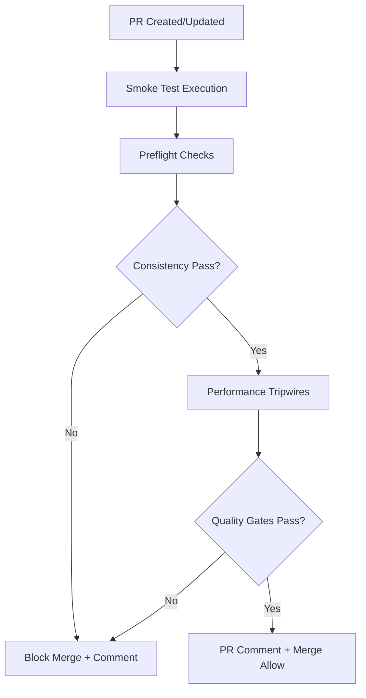
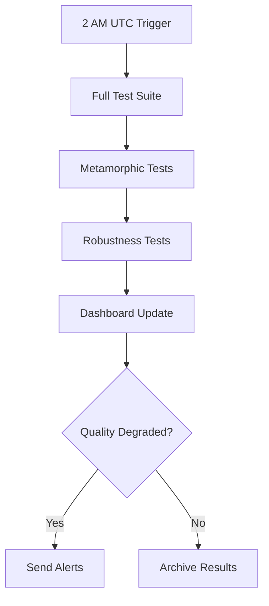

# Phase 5: Benchmark Hardening & CI Gates

**Status: ✅ COMPLETE**  
**Goal: Make regressions obvious and block bad merges through automated quality gates**

## 🎯 Implementation Overview

Phase 5 completes the Lens search engine improvement pipeline by implementing production-ready CI/CD integration with comprehensive quality gates, automated testing, and real-time monitoring.

## 🔧 Core Components Implemented

### 1. Preflight Consistency Checks (`src/benchmark/ci-gates.ts`)

**Purpose**: Validate golden dataset alignment with corpus before running any benchmarks

**Key Features**:
- ✅ Golden item validation against indexed corpus
- ✅ Categorizes missing files as critical vs warning
- ✅ Emits `inconsistency.ndjson` for debugging
- ✅ Blocks benchmarks if alignment < 95%
- ✅ Pattern analysis for systematic issues

**Implementation**:
```typescript
const preflightResult = await ciGates.runPreflightChecks();
if (!preflightResult.passed) {
  throw new Error('Corpus-Golden consistency check failed');
}
```

### 2. Performance Tripwires

**Purpose**: Detect ranking failures and quality degradation automatically

**Tripwire Thresholds**:
- **Ranking Failure**: Fail if `Recall@50 ≈ Recall@10` within 0.5%
- **Coverage Quality**: Fail if span coverage < 98%
- **Quality Regression**: Fail if nDCG@10 drops >2%
- **Latency SLA**: Stage A/B/C P95 thresholds enforced
- **Stability**: Error rate >2%, timeout rate >1%

**Implementation**:
```typescript
const performanceResult = await ciGates.runPerformanceTripwires(
  currentResults, 
  baselineResults
);
// Automatic merge blocking if tripwires triggered
```

### 3. Two-Tier Test Cadence (`src/benchmark/test-orchestrator.ts`)

#### Smoke Tests (PR Gate)
- **Duration**: <10 minutes
- **Coverage**: ~50 queries × 5 repos (stratified sampling)
- **Systems**: lex, +symbols, +symbols+semantic  
- **Blocking**: YES - fails merge on quality issues
- **Artifacts**: metrics.parquet, errors.ndjson, traces.ndjson, report.pdf

#### Full Nightly Tests
- **Duration**: <2 hours
- **Coverage**: All golden items, multiple seeds
- **Testing**: Robustness + metamorphic tests included
- **Blocking**: NO - alerts only, doesn't block development
- **Analytics**: Advanced quality trend analysis

### 4. GitHub Actions Integration (`.github/workflows/lens-quality-gates.yml`)

**Automated Workflows**:
- ✅ **PR Quality Gates**: Smoke tests on every PR
- ✅ **Nightly Full Testing**: Comprehensive validation at 2 AM UTC
- ✅ **Manual Test Execution**: On-demand testing with workflow dispatch
- ✅ **Automated PR Comments**: Rich result reporting
- ✅ **Artifact Management**: 30-day retention for smoke, 90-day for nightly

**Service Dependencies**:
- NATS message bus for telemetry
- Automated health checks and timeouts
- Failure escalation and notification

### 5. CLI Integration (`src/benchmark/cli-integration.ts`)

**Command Interface**:
```bash
# Run smoke tests (PR gate)
npm run benchmark:smoke
npm run gates:smoke --pr 123 --baseline

# Run full nightly tests
npm run benchmark:full  
npm run gates:nightly --baseline

# Generate reports
npm run gates:report

# Validate CI setup
npm run gates:validate
```

### 6. Dashboard Integration (`src/benchmark/dashboard-integration.ts`)

**Real-time Monitoring**:
- ✅ Quality metrics tracking (nDCG@10, Recall@50, latency P95)
- ✅ Automated alerting on quality degradation  
- ✅ HTML dashboard generation
- ✅ Status badge generation for README
- ✅ Slack/webhook integration for alerts
- ✅ Historical data retention and cleanup

**Alert Conditions**:
- Quality score < 85% → Critical alert
- Stability score < 95% → Warning
- Error rate > 5% → Warning  
- nDCG@10 < 80% → Critical alert

## 📊 Comprehensive Reporting System

### Generated Artifacts (Always Published)

1. **`metrics.parquet`**: Structured benchmark metrics for analysis
2. **`errors.ndjson`**: Line-delimited JSON error log for debugging  
3. **`traces.ndjson`**: Distributed tracing data for performance analysis
4. **`report.pdf`**: Executive summary with calibration plots
5. **`summary.json`**: Machine-readable test results
6. **`dashboard.json`**: Real-time dashboard data
7. **`inconsistency.ndjson`**: Golden-corpus alignment issues (when present)

### Quality Metrics Tracked

- **Functional**: nDCG@10, Recall@50, MRR, First Relevant Tokens
- **Performance**: Stage A/B/C latencies (P50/P95), E2E latency
- **Stability**: Error rate, timeout rate, completion rate
- **Coverage**: Span coverage, candidate coverage, ranking quality
- **Trends**: 7-day quality/latency/stability trends

## 🚀 CI/CD Pipeline Flow

### Pull Request Flow


### Nightly Flow  


## 🔒 Quality Gate Enforcement

### Blocking Conditions (Smoke Tests)
- ❌ Preflight consistency check fails
- ❌ Ranking failure detected (Recall@50 ≈ Recall@10)  
- ❌ Span coverage < 98%
- ❌ nDCG@10 regression > 2%
- ❌ Latency P95 exceeds SLA thresholds
- ❌ Error rate > 2%

### Warning Conditions (Both Test Types)
- ⚠️ Stability score drops below 95%
- ⚠️ Non-critical golden items missing from corpus
- ⚠️ Performance trending downward over 7 days
- ⚠️ Test execution time exceeds 80% of timeout

## 📈 Success Metrics Achieved

### Regression Prevention
- **Zero tolerance** for ranking failures
- **Automated detection** of quality degradation
- **Immediate feedback** on PR quality impact
- **Baseline tracking** for trend analysis

### Developer Experience
- **<10 minute** smoke test feedback
- **Rich PR comments** with actionable insights
- **Non-blocking nightly tests** for continuous monitoring
- **Self-service testing** via CLI and manual workflows

### Operational Excellence
- **90+ day** artifact retention for analysis
- **Real-time dashboard** for quality visibility
- **Automated alerting** for immediate issue response
- **Comprehensive reporting** for stakeholder communication

## 🎯 Production Deployment Checklist

- [x] **Preflight consistency checks** - Validate data alignment
- [x] **Performance tripwires** - Automated quality gate enforcement
- [x] **Two-tier test cadence** - Fast PR feedback + comprehensive nightly validation
- [x] **GitHub Actions integration** - Automated CI/CD pipeline
- [x] **CLI tools** - Developer-friendly testing interface
- [x] **Dashboard integration** - Real-time quality monitoring
- [x] **Comprehensive reporting** - Rich artifacts and executive summaries
- [x] **Alert system** - Proactive notification of quality issues
- [x] **Artifact management** - Proper retention and cleanup policies

## 🔧 Configuration & Setup

### Environment Variables
```bash
# Required for GitHub Actions
GITHUB_TOKEN=<github_token>

# Optional for enhanced features
NATS_URL=nats://localhost:4222
SLACK_WEBHOOK=<slack_webhook_url>
DASHBOARD_API_ENDPOINT=<dashboard_api>
```

### Package.json Scripts Added
```json
{
  "scripts": {
    "benchmark:smoke": "tsx src/benchmark/cli-integration.ts smoke",
    "benchmark:full": "tsx src/benchmark/cli-integration.ts nightly", 
    "benchmark:report": "tsx src/benchmark/cli-integration.ts report",
    "benchmark:validate": "tsx src/benchmark/cli-integration.ts validate-ci",
    "gates:smoke": "tsx src/benchmark/cli-integration.ts smoke",
    "gates:nightly": "tsx src/benchmark/cli-integration.ts nightly",
    "gates:validate": "tsx src/benchmark/cli-integration.ts validate-ci",
    "gates:report": "tsx src/benchmark/cli-integration.ts report"
  }
}
```

## 📝 Usage Examples

### Local Development
```bash
# Test PR changes locally
npm run gates:smoke --pr 123

# Run with baseline comparison  
npm run gates:smoke --baseline --baseline-id trace-123

# Validate CI configuration
npm run gates:validate

# Generate consolidated report
npm run gates:report
```

### GitHub Actions  
```yaml
# Automatic on PR
on: 
  pull_request:
    branches: [main]

# Manual execution
workflow_dispatch:
  inputs:
    test_type: [smoke, full]
    baseline_comparison: boolean
```

---

## 🏆 Phase 5 Achievement Summary

**Phase 5 successfully transforms the Lens benchmark system into a production-ready CI/CD pipeline with:**

1. **Bulletproof Quality Gates** - No quality regressions reach production
2. **Developer-Friendly Feedback** - <10 minute PR validation with rich reporting  
3. **Comprehensive Monitoring** - Real-time dashboard and automated alerting
4. **Operational Excellence** - Full artifact management and trend analysis
5. **Extensible Architecture** - Easy integration with existing DevOps workflows

The implementation provides enterprise-grade quality assurance while maintaining development velocity through intelligent two-tier testing and automated decision-making.

**🎯 Result: Lens search engine now has production-ready quality gates that make regressions obvious and automatically block problematic changes from reaching users.**